# 07-sequence_diagrams.md

# Personal Finance Tracking Platform

Version: 1.0

Status: Approved

Document Type: Sequence Diagrams and Workflow Specification

Architecture Style: Modular Monolith

Backend Framework: FastAPI

Database: PostgreSQL

Last Updated: 2026-06-02

---

# 1. Purpose

This document defines the major system workflows and sequence diagrams for the Personal Finance Tracking Platform.

It explains how actors, modules, services, and storage components interact during important business processes.

This document must be used when implementing:

* Ingestion workflows
* Parser workflows
* Transaction creation workflows
* Account discovery workflows
* Telegram feedback workflows
* Transfer detection workflows
* Balance reconciliation workflows
* Future AI workflows
* Future Account Aggregator workflows

---

# 2. Sequence Diagram Principles

## 2.1 Raw Event First

All external input must first be stored as a raw event before any parsing or processing occurs.

Rule:

```text
External Input
↓
Raw Event
↓
Processing
```

---

## 2.2 No Data Loss

If parsing fails, the raw event must remain available for future reprocessing.

---

## 2.3 Domain Events

Important business actions should publish domain events.

Examples:

* TransactionCreated
* TransactionUpdated
* NewAccountDetected
* UserFeedbackReceived
* BalanceReconciled
* AuditEventCreated

---

## 2.4 User Ownership

Every workflow must preserve user ownership through `user_id`.

---

# 3. SMS Ingestion and Transaction Creation Flow

## 3.1 Description

This is the main MVP workflow.

A bank SMS arrives on the Android phone. MacroDroid forwards the SMS to the FastAPI backend. The backend stores the raw message, parses it, resolves the account, merchant, category, creates a transaction, updates balance, and optionally sends a Telegram notification.

---

## 3.2 Text Flow

```text
Bank SMS
    ↓
Android Phone
    ↓
MacroDroid
    ↓
POST /api/v1/ingest/sms
    ↓
Ingestion API
    ↓
Raw Event Service
    ↓
raw_events table
    ↓
Parser Engine
    ↓
Account Resolver
    ↓
Merchant Resolver
    ↓
Category Resolver
    ↓
Transaction Engine
    ↓
transactions table
    ↓
TransactionCreated Event
    ↓
Balance Engine
    ↓
Telegram Notifier
    ↓
Audit Logger
```

---

## 3.3 Mermaid Sequence Diagram

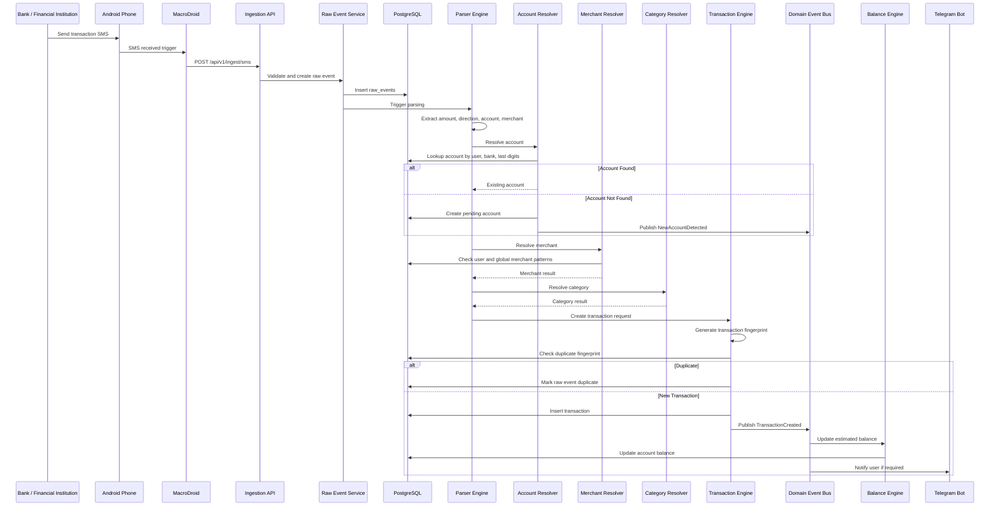

---

# 4. Duplicate SMS Flow

## 4.1 Description

Duplicate SMS messages may happen because of SMS retransmission, historical import, or reprocessing. The system must avoid duplicate transaction creation.

---

## 4.2 Text Flow

```text
Incoming SMS
    ↓
Generate message_hash
    ↓
Check raw_events
    ↓
If same hash exists:
        Mark duplicate raw event
        Do not create transaction
    ↓
If hash is new:
        Continue processing
```

---

## 4.3 Mermaid Sequence Diagram

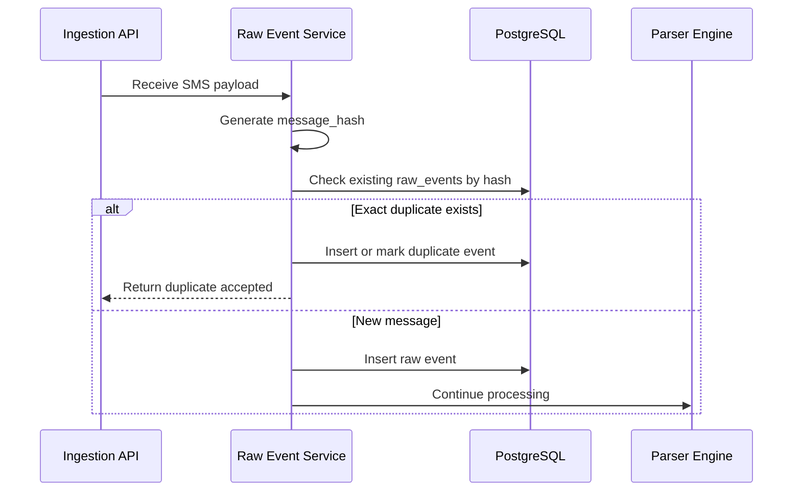

---

# 5. Account Discovery Flow

## 5.1 Description

When a transaction references a bank account or credit card that is not yet known, the system creates a pending account and asks the user to provide a friendly name.

---

## 5.2 Text Flow

```text
Parser detects bank and last digits
    ↓
Account Resolver checks accounts
    ↓
No matching account found
    ↓
Create Pending Account
    ↓
Publish NewAccountDetected
    ↓
Telegram asks user to name account
    ↓
User replies
    ↓
Account updated
    ↓
Audit log created
```

---

## 5.3 Mermaid Sequence Diagram

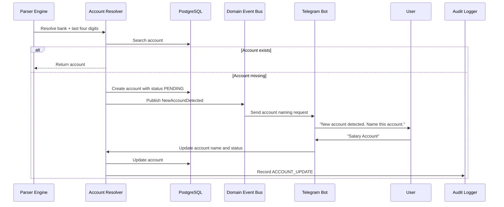

---

# 6. Telegram Description Collection Flow

## 6.1 Description

When a transaction is created, the Telegram bot may ask the user for an optional description. The user can respond immediately or later using the transaction ID.

---

## 6.2 Text Flow

```text
Transaction Created
    ↓
Telegram sends message with transaction ID
    ↓
User replies with transaction ID + description
    ↓
Telegram webhook receives reply
    ↓
Feedback Service parses reply
    ↓
Transaction updated
    ↓
Audit log created
```

---

## 6.3 Mermaid Sequence Diagram

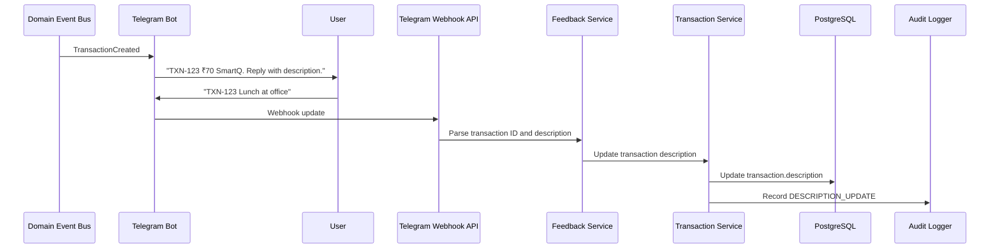

---

# 7. Category Correction Flow

## 7.1 Description

The user may correct a transaction category through Telegram or future UI. This correction should update the transaction, create feedback history, create audit log, and optionally update merchant patterns.

---

## 7.2 Text Flow

```text
User replies with corrected category
    ↓
Feedback Service validates category
    ↓
Transaction category updated
    ↓
User feedback stored
    ↓
Audit log created
    ↓
Learning Engine evaluates rule creation
```

---

## 7.3 Mermaid Sequence Diagram

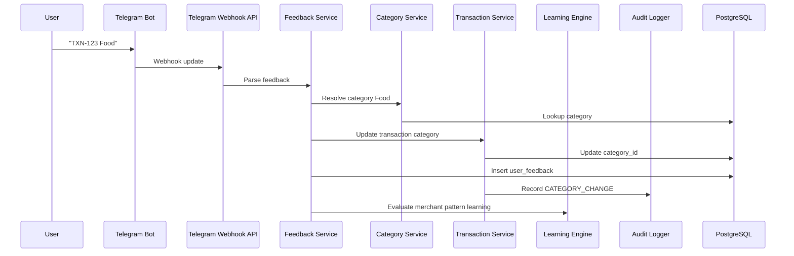

---

# 8. Merchant Learning Flow

## 8.1 Description

When a user corrects a merchant or category, the system may create a user-specific merchant pattern so future similar transactions are categorized automatically.

---

## 8.2 Text Flow

```text
User corrects transaction
    ↓
Learning Engine checks merchant_raw
    ↓
Creates user merchant pattern
    ↓
Future transactions use this rule
```

---

## 8.3 Mermaid Sequence Diagram

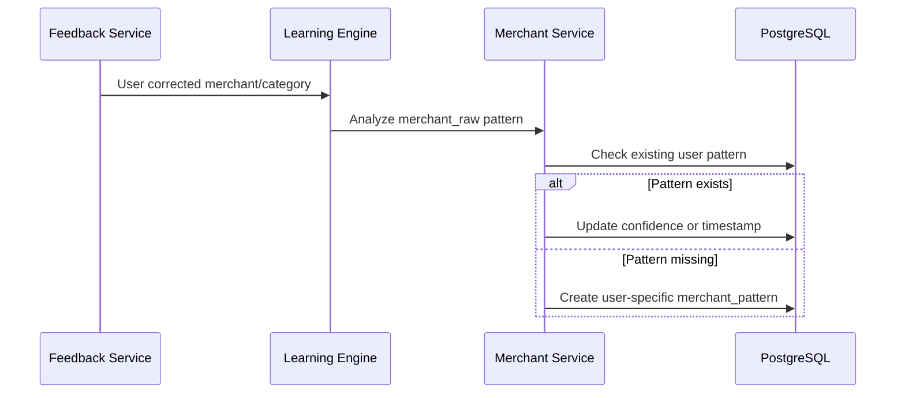

---

# 9. Transfer Detection Flow

## 9.1 Description

Transfers must be identified so they are not counted as income or expenses. Credit card bill payments, own-account transfers, and cash withdrawals are examples of transfers.

---

## 9.2 Text Flow

```text
Transaction created
    ↓
Transaction Engine checks transfer indicators
    ↓
If likely transfer:
        business_type = TRANSFER
        Create transfer candidate
    ↓
If matching opposite transaction exists:
        Link source and destination
    ↓
If not:
        Store partial transfer
```

---

## 9.3 Mermaid Sequence Diagram

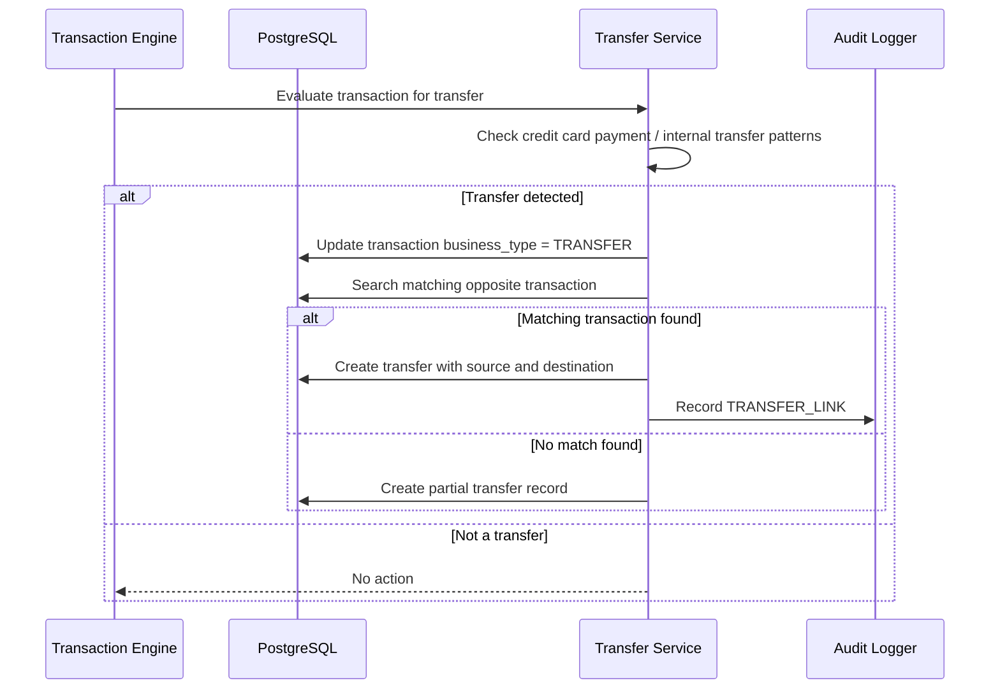

---

# 10. Balance Update Flow

## 10.1 Description

After a transaction is created, the balance engine updates the estimated balance of the affected account.

---

## 10.2 Text Flow

```text
TransactionCreated event
    ↓
Balance Engine receives event
    ↓
Determine account type
    ↓
Apply debit/credit rule
    ↓
Update estimated_balance
    ↓
Optionally create balance snapshot
```

---

## 10.3 Mermaid Sequence Diagram

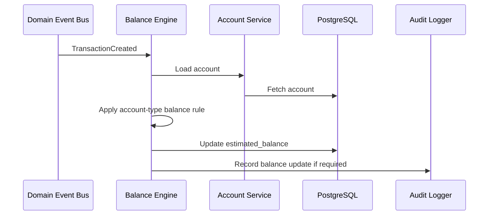

---

# 11. Balance Reconciliation Flow

## 11.1 Description

Estimated balances may drift due to missed SMS, cash transactions, or parsing issues. Reconciliation allows the user to enter the actual account balance.

---

## 11.2 Text Flow

```text
User provides actual balance
    ↓
System compares estimated balance
    ↓
Difference calculated
    ↓
Estimated balance updated
    ↓
Balance snapshot created
    ↓
Audit log created
```

---

## 11.3 Mermaid Sequence Diagram

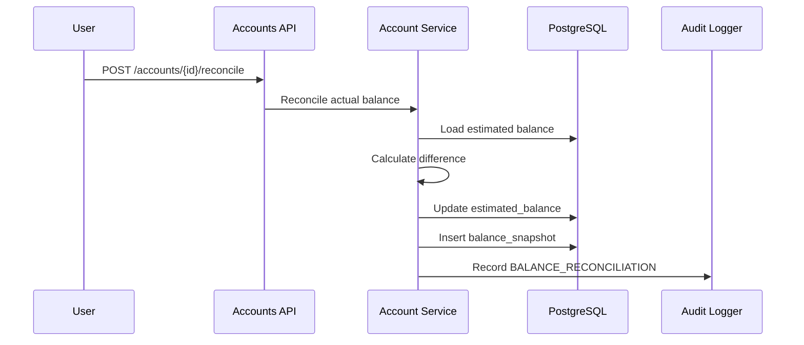

---

# 12. Historical SMS Import Flow

## 12.1 Description

The user may choose to import historical SMS messages from a custom date range or predefined range such as last 3 months, last 6 months, last 1 year, or all available.

---

## 12.2 Text Flow

```text
User selects import range
    ↓
MacroDroid or future Android App exports messages
    ↓
Backend receives batch
    ↓
Each message stored as raw_event
    ↓
Each raw_event processed
    ↓
Duplicates skipped
```

---

## 12.3 Mermaid Sequence Diagram

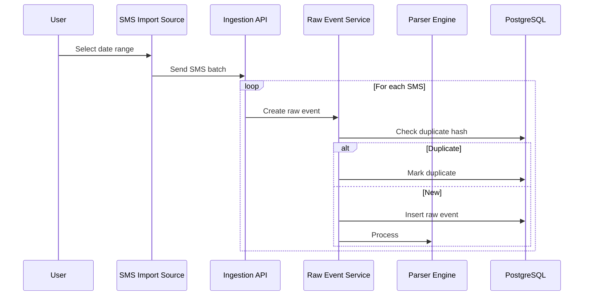

---

# 13. Future AI Suggestion Flow

## 13.1 Description

AI may suggest merchant or category values in future phases. AI must not directly modify financial records.

---

## 13.2 Text Flow

```text
Unknown transaction
    ↓
AI Suggestion Service
    ↓
Local Ollama Model
    ↓
Suggestion generated
    ↓
If confidence high:
        Store suggestion
    ↓
If user approval required:
        Ask via Telegram
    ↓
User accepts or rejects
```

---

## 13.3 Mermaid Sequence Diagram

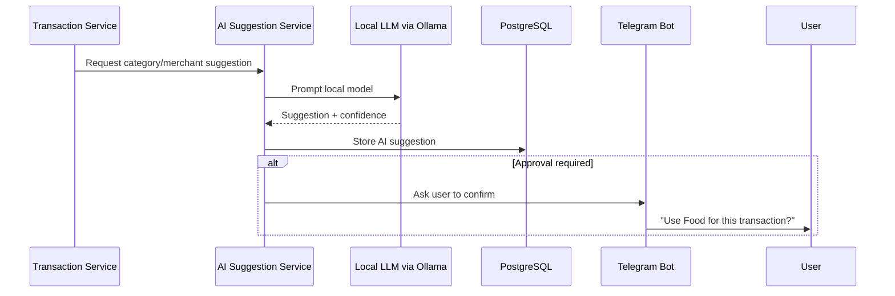

---

# 14. Future Account Aggregator Flow

## 14.1 Description

AA integration should be implemented as another ingestion adapter, not as a separate transaction engine.

---

## 14.2 Text Flow

```text
User grants AA consent
    ↓
AA Provider sends financial data
    ↓
AA Adapter receives structured transaction
    ↓
Raw Event stored
    ↓
Normalizer converts to transaction contract
    ↓
Transaction Engine processes normally
```

---

## 14.3 Mermaid Sequence Diagram

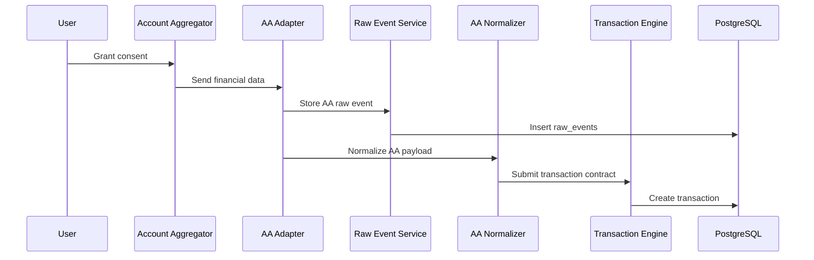

---

# 15. Authentication Flows

## 15.1 Description

Users authenticate using email and password. API access requires a JWT access
token. Refresh-token exchange uses a refresh token in the request body and then
validates the current database user before issuing a new access token.

---

## 15.2 Login Text Flow

```text
User Login
    ↓
Auth API
    ↓
Validate Password
    ↓
Generate Access Token
    ↓
Generate Refresh Token
    ↓
Return Tokens
```

---

## 15.3 Login Sequence Diagram

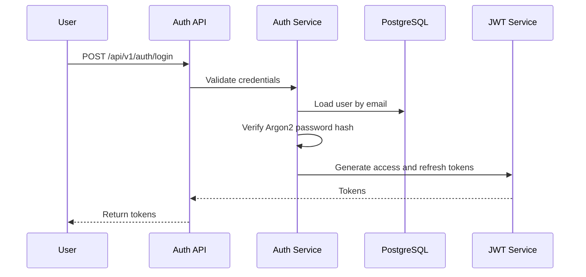

---

## 15.4 Protected Request Middleware Flow

```text
Client Request
    ↓
Authentication Middleware
    ↓
Extract Bearer Access Token
    ↓
Validate Signature, Expiry, And Token Type
    ↓
Load Current User
    ↓
Reject Missing, Disabled, Or Soft Deleted User
    ↓
Attach User To Request State
    ↓
Route Handler Uses get_current_user
```

---

## 15.5 Protected Request Sequence Diagram

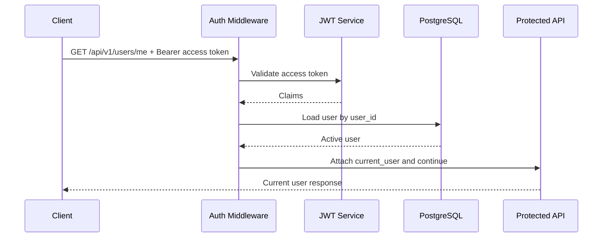

---

## 15.6 Refresh Token Sequence Diagram

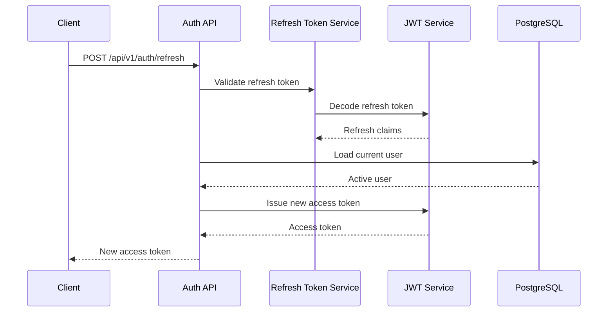

---

# 16. Error Handling Flow

## 16.1 Parser Failure

```text
Raw Event Stored
    ↓
Parser Fails
    ↓
processing_status = FAILED
    ↓
processing_error stored
    ↓
Transaction not created
    ↓
User may review later
```

---

## 16.2 Mermaid Sequence Diagram

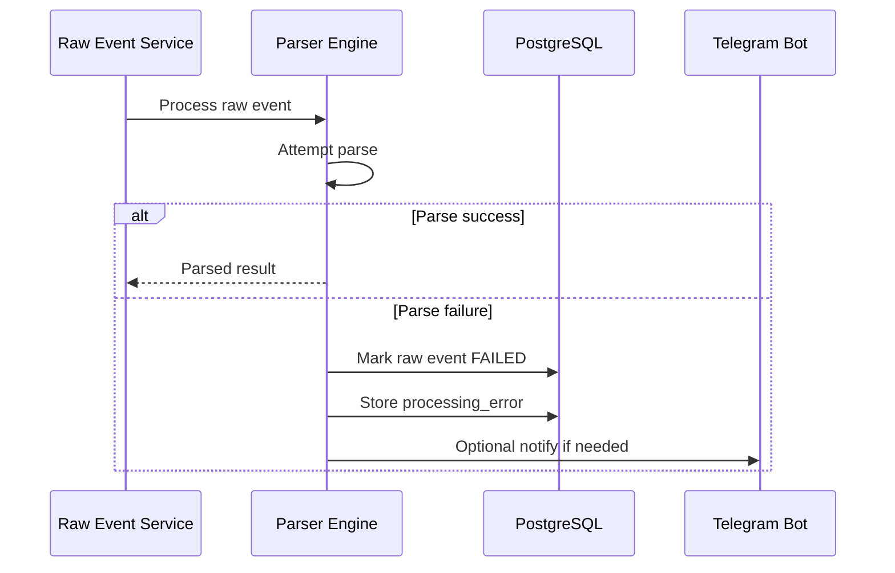

---

# 17. Sequence Diagram Rules for AI Agents

AI coding agents must follow these workflow rules:

* Store raw event before processing.
* Do not create transaction if duplicate.
* Do not skip account resolution.
* Do not skip user ownership validation.
* Do not hard delete transactions.
* Do not let AI directly mutate transactions.
* Do not classify transfers as expenses.
* Do not treat all credits as income.
* Always create audit log for user-driven corrections.
* Use domain events for cross-module side effects.

---

# 18. Approval

Status: Approved

This document is the authoritative workflow and sequence diagram specification for the Personal Finance Tracking Platform.

All workflow implementations must align with this document.
