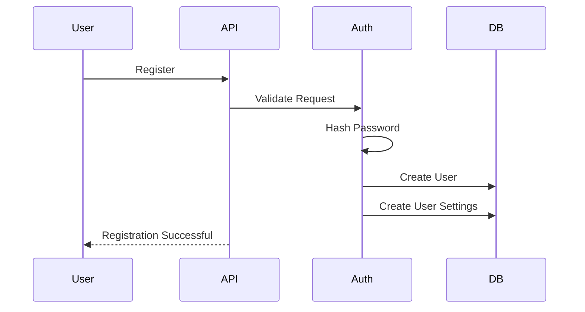
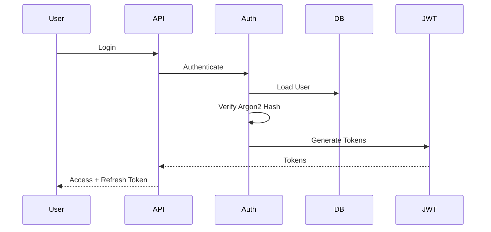
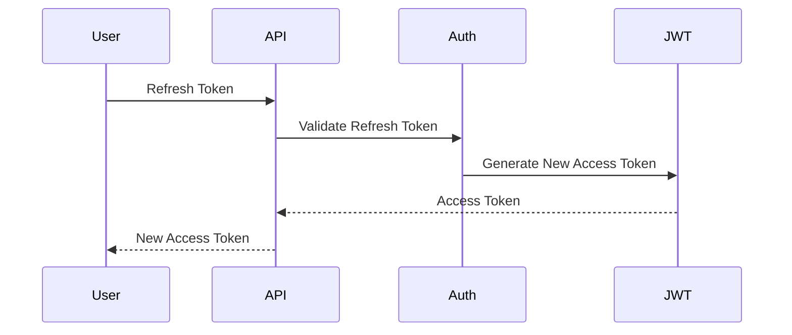

# 16-authentication_design.md

# Personal Finance Tracking Platform

Version: 1.0

Status: Approved

Document Type: Authentication & Authorization Design

Framework: FastAPI

Authentication Method: JWT

Password Hashing: Argon2id

Last Updated: 2026-06-02

---

# 1. Purpose

This document defines the complete authentication and authorization architecture for the Personal Finance Tracking Platform.

It specifies:

* User Authentication
* JWT Design
* Token Lifecycle
* Authorization Rules
* Session Management
* API Security
* Telegram Identity Mapping
* Future MFA Design
* Future SaaS Requirements

This document serves as the source of truth for:

* Auth APIs
* JWT Middleware
* User Security
* Access Control
* Permission Enforcement

---

# 2. Authentication Strategy

The platform uses:

```text
Email + Password
+
JWT Authentication
```

Reason:

* SaaS Ready
* Mobile Ready
* Web Ready
* API Friendly
* Industry Standard

---

# 3. Authentication Architecture

```text
User
  ↓
Login API
  ↓
Auth Service
  ↓
Password Verification
  ↓
JWT Service
  ↓
Access Token
+
Refresh Token
  ↓
Client
```

---

# 4. Identity Model

Every user has:

```text
User Account
```

Identity is represented by:

```text
users.id (UUID)
```

This UUID becomes the primary identity used across:

* Accounts
* Transactions
* Categories
* Audit Logs
* Telegram Integration

---

# 5. User Registration Flow

## Flow

```text
User
↓
Register
↓
Validate Email
↓
Validate Password
↓
Hash Password
↓
Create User
↓
Create User Settings
↓
Return Success
```

---

## Sequence



---

# 6. Login Flow

## Flow

```text
User
↓
Email + Password
↓
Validate User
↓
Verify Password
↓
Generate JWT Tokens
↓
Return Tokens
```

---

## Sequence Diagram



---

# 7. Password Security

## Algorithm

Selected:

```text
Argon2id
```

Reason:

* Modern Standard
* GPU Resistant
* Memory Hard
* OWASP Recommended

---

## Forbidden Algorithms

```text
MD5
SHA1
SHA256
Base64
Plain Text
```

---

## Password Requirements

Minimum:

```text
8 Characters
```

Recommended:

```text
12+ Characters
```

Require:

```text
Uppercase
Lowercase
Number
```

---

# 8. JWT Design

Two token model.

---

## Access Token

Purpose:

```text
API Authentication
```

Lifetime:

```text
60 Minutes
```

---

## Refresh Token

Purpose:

```text
Generate New Access Tokens
```

Lifetime:

```text
30 Days
```

---

# 9. JWT Payload

## Access Token Claims

```json
{
  "sub": "user_uuid",
  "email": "user@example.com",
  "token_type": "access",
  "iat": 1717000000,
  "exp": 1717003600
}
```

---

## Refresh Token Claims

```json
{
  "sub": "user_uuid",
  "token_type": "refresh",
  "iat": 1717000000,
  "exp": 1719592000
}
```

---

# 10. JWT Signing

## MVP

Algorithm:

```text
HS256
```

Secret:

```text
JWT_SECRET
```

Environment Variable.

---

## Future SaaS

Algorithm:

```text
RS256
```

Public/Private Key Pair.

---

# 11. Authentication Middleware

Every protected endpoint must pass through:

```text
JWT Middleware
```

Flow:

```text
Request
↓
Extract Token
↓
Verify Signature
↓
Verify Expiration
↓
Load User
↓
Attach Current User
↓
Continue
```

---

# 12. Authorization Model

Authentication answers:

```text
Who Are You?
```

Authorization answers:

```text
Can You Access This?
```

---

# 13. Ownership-Based Authorization

The system uses ownership authorization.

Rule:

```python
resource.user_id == current_user.id
```

Must be validated everywhere.

---

## Example

Correct:

```sql
SELECT *
FROM transactions
WHERE id = :transaction_id
AND user_id = :current_user_id;
```

Incorrect:

```sql
SELECT *
FROM transactions
WHERE id = :transaction_id;
```

---

# 14. Authorization Levels

## User

Can access:

* Own Accounts
* Own Transactions
* Own Categories
* Own Reports

Cannot access:

* Other Users

---

## Admin (Future)

Can access:

* Monitoring
* User Management
* System Health

Cannot directly modify:

* Financial Transactions

Without audit logging.

---

# 15. Current User Dependency

FastAPI Dependency:

```python
get_current_user()
```

Responsibilities:

* Decode JWT
* Validate Signature
* Validate Expiry
* Load User
* Return User Context

---

# 16. Session Management

MVP:

Stateless JWT.

Server stores:

```text
Nothing
```

except user records.

---

## Future SaaS

Add:

```text
refresh_token_store
```

to support:

* Logout
* Session Revocation
* Multi-device Management

---

# 17. Logout Design

## MVP

Client deletes tokens.

---

## Future SaaS

Store:

```text
token_jti
```

and revoke.

Flow:

```text
Logout
↓
Blacklist Refresh Token
↓
Reject Future Refresh Requests
```

---

# 18. Password Reset Design

Future Feature.

---

## Flow

```text
User Requests Reset
↓
Generate Token
↓
Send Email
↓
User Resets Password
↓
Invalidate Sessions
```

---

## Reset Token Lifetime

```text
15 Minutes
```

---

# 19. Email Verification

Future SaaS Requirement.

Flow:

```text
Register
↓
Send Verification Email
↓
User Clicks Link
↓
Account Verified
```

---

# 20. Telegram Identity Integration

Telegram is NOT authentication.

Telegram is:

```text
Communication Channel
```

Only.

---

## Telegram Mapping

Store:

```text
telegram_chat_id
```

inside:

```text
users
```

table.

---

## Telegram Ownership Validation

When Telegram webhook arrives:

```text
chat_id
↓
user lookup
↓
ownership validation
↓
execute action
```

---

# 21. MacroDroid Authentication

SMS ingestion endpoints use:

```text
API Key Authentication
```

Not JWT.

---

## Header

```http
X-API-KEY: secret_key
```

---

## Validation

```text
Compare Hash
↓
Allow Request
```

---

## Storage

Hash API keys before storing.

Never store plaintext.

---

# 22. Future MFA Design

Not required for MVP.

Future:

```text
TOTP
Authenticator App
```

Preferred.

---

## Supported MFA

```text
Google Authenticator
Microsoft Authenticator
Authy
```

---

## Not Preferred

```text
SMS OTP
```

Reason:

SIM Swap Risk.

---

# 23. Account Lockout

Future SaaS Requirement.

After:

```text
5 Failed Attempts
```

Lock:

```text
15 Minutes
```

---

## Audit Event

```text
ACCOUNT_LOCKED
```

must be recorded.

---

# 24. Token Refresh Flow

```text
Access Token Expired
↓
Refresh Token Submitted
↓
Validate Refresh Token
↓
Generate New Access Token
↓
Return Token
```

---

## Sequence Diagram



---

# 25. Authentication Audit Events

The following events must be logged:

```text
USER_REGISTERED
USER_LOGIN
USER_LOGOUT
TOKEN_REFRESHED
PASSWORD_CHANGED
PASSWORD_RESET_REQUESTED
PASSWORD_RESET_COMPLETED
ACCOUNT_LOCKED
ACCOUNT_UNLOCKED
```

---

# 26. Authentication Error Codes

## Login Errors

```text
INVALID_CREDENTIALS
ACCOUNT_DISABLED
ACCOUNT_LOCKED
```

---

## JWT Errors

```text
INVALID_TOKEN
TOKEN_EXPIRED
TOKEN_REVOKED
```

---

## Authorization Errors

```text
ACCESS_DENIED
USER_MISMATCH
RESOURCE_FORBIDDEN
```

---

# 27. Security Monitoring

Monitor:

```text
Failed Logins
Token Failures
Authorization Failures
Password Reset Requests
```

Generate alerts for abnormal activity.

---

# 28. Future OAuth Support

Future integrations:

```text
Google Login
Microsoft Login
GitHub Login
```

Supported through:

```text
OAuth2
OpenID Connect
```

---

# 29. Authentication Database Objects

Current Tables:

```text
users
user_settings
audit_log
```

Future Tables:

```text
refresh_tokens
email_verifications
password_reset_tokens
mfa_secrets
login_attempts
```

---

# 30. Future Multi-Device Support

Future SaaS:

Support:

```text
Device Name
Device ID
Login History
Active Sessions
Session Revocation
```

---

# 31. AI Agent Implementation Rules

AI coding agents must:

* Use FastAPI dependency injection.
* Use Argon2id hashing.
* Use JWT authentication.
* Implement ownership validation.
* Generate auth middleware.
* Generate refresh token workflow.
* Generate audit events.

AI coding agents must not:

* Store plaintext passwords.
* Store plaintext API keys.
* Skip ownership validation.
* Skip JWT validation.
* Use insecure hashing algorithms.

---

# 32. Approval

Status: Approved

This document is the authoritative Authentication and Authorization Design for the Personal Finance Tracking Platform.

All authentication flows, JWT middleware, authorization checks, ownership validation, and future security enhancements must comply with this design.
