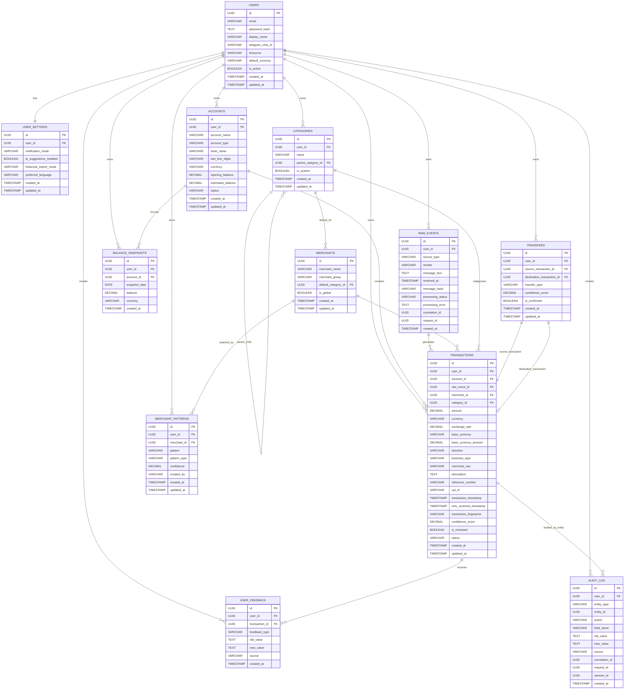

# 18-database_erd.md

# Personal Finance Tracking Platform

Version: 1.0

Status: Approved

Document Type: Database Entity Relationship Diagram

Database: PostgreSQL

ORM Target: SQLModel

Migration Tool: Alembic

Last Updated: 2026-06-02

---

# 1. Purpose

This document defines the database entity relationship model for the Personal Finance Tracking Platform.

It provides:

* Mermaid ERD
* Textual relationship definitions
* Cardinality rules
* Ownership rules
* Transfer modeling
* Audit trail relationships
* Future SaaS expansion guidance

This document must be used when generating:

* SQLModel relationships
* Alembic migrations
* Repository joins
* Reporting queries
* Domain service relationships

---

# 2. ERD Design Principles

## 2.1 User Ownership

Every user-owned business entity must be linked to:

```text
users.id
```

This supports future SaaS deployment.

---

## 2.2 UUID Relationships

All relationships must use UUID foreign keys.

No integer keys are allowed.

---

## 2.3 Raw Event Traceability

Every transaction should be traceable to a source event when possible.

Source events are stored in:

```text
raw_events
```

---

## 2.4 Financial Immutability

Transactions and audit logs are not physically deleted.

---

## 2.5 Transfer Modeling

Transfers are modeled as relationships between two transactions.

This prevents credit card payments and own-account transfers from being incorrectly counted as expenses or income.

---

# 3. Mermaid ERD



---

# 4. Textual Relationship Model

## 4.1 User to User Settings

Relationship:

```text
1 User
↓
1 User Settings Record
```

Cardinality:

```text
1:1
```

Rule:

Each user must have exactly one settings record.

---

## 4.2 User to Accounts

Relationship:

```text
1 User
↓
Many Accounts
```

Examples:

```text
Murali
├── Salary Account
├── HDFC Savings
├── ICICI Credit Card
└── Cash Wallet
```

Cardinality:

```text
1:N
```

Rule:

An account belongs to exactly one user.

---

## 4.3 User to Raw Events

Relationship:

```text
1 User
↓
Many Raw Events
```

Raw events may come from:

* SMS
* Telegram
* Email
* CSV
* Account Aggregator
* API

Cardinality:

```text
1:N
```

Rule:

Raw events are immutable and must never be deleted.

---

## 4.4 User to Transactions

Relationship:

```text
1 User
↓
Many Transactions
```

Cardinality:

```text
1:N
```

Rule:

Every transaction must belong to exactly one user.

---

## 4.5 Account to Transactions

Relationship:

```text
1 Account
↓
Many Transactions
```

Examples:

```text
Salary Account
├── Salary Credit
├── Swiggy Debit
├── SmartQ Debit
└── Credit Card Payment Debit
```

Cardinality:

```text
1:N
```

Rule:

Every transaction impacts exactly one account.

---

## 4.6 Raw Event to Transactions

Relationship:

```text
1 Raw Event
↓
0 or More Transactions
```

Cardinality:

```text
1:0..N
```

Reason:

Some raw events do not create transactions.

Examples:

* Promotional SMS
* OTP
* EMI Reminder
* Bank Alert
* Duplicate Message

Some raw events may create more than one transaction in future sources.

Example:

* CSV file row batches
* AA data packets

---

## 4.7 Merchant to Transactions

Relationship:

```text
1 Merchant
↓
Many Transactions
```

Example:

```text
Swiggy
├── Transaction 1
├── Transaction 2
└── Transaction 3
```

Cardinality:

```text
1:N
```

Rule:

Merchant is optional because some transactions may be unclassified.

---

## 4.8 Category to Transactions

Relationship:

```text
1 Category
↓
Many Transactions
```

Cardinality:

```text
1:N
```

Rule:

Category is optional during initial parsing.

Transactions may remain Uncategorized until user or system resolves them.

---

## 4.9 Category Parent-Child Relationship

Relationship:

```text
1 Category
↓
Many Child Categories
```

Example:

```text
Food
├── Dining Out
├── Groceries
└── Food Delivery
```

Cardinality:

```text
1:N recursive
```

Rule:

Parent category is optional.

---

## 4.10 Merchant to Merchant Patterns

Relationship:

```text
1 Merchant
↓
Many Merchant Patterns
```

Example:

```text
Swiggy
├── upiswiggy@%
├── swiggyupi%
└── swiggyonline%
```

Cardinality:

```text
1:N
```

Rule:

Patterns can be global or user-specific.

---

## 4.11 User to Merchant Patterns

Relationship:

```text
1 User
↓
Many Personal Merchant Patterns
```

Cardinality:

```text
1:N
```

Rule:

User-specific patterns override global patterns.

Global patterns have:

```text
user_id = NULL
```

---

## 4.12 Transaction to User Feedback

Relationship:

```text
1 Transaction
↓
Many Feedback Records
```

Example:

```text
Transaction
├── Category Changed
├── Description Added
└── Merchant Corrected
```

Cardinality:

```text
1:N
```

Rule:

Feedback is historical and should not be deleted.

---

## 4.13 Account to Balance Snapshots

Relationship:

```text
1 Account
↓
Many Balance Snapshots
```

Example:

```text
Salary Account
├── 2026-06-01 Balance
├── 2026-06-02 Balance
└── 2026-06-03 Balance
```

Cardinality:

```text
1:N
```

Rule:

One balance snapshot per account per date.

---

## 4.14 User to Audit Log

Relationship:

```text
1 User
↓
Many Audit Records
```

Cardinality:

```text
1:N
```

Rule:

Every important change must be auditable.

---

# 5. Transfer Relationship Model

Transfers are modeled as a linking entity between two transactions.

This is critical for accurate financial reporting.

---

## 5.1 Transfer Example

Scenario:

User pays credit card bill from bank account.

```text
HDFC Savings
↓ Debit ₹10,000
ICICI Credit Card
↓ Credit ₹10,000
```

This should not be counted as:

```text
Expense
```

or

```text
Income
```

It must be counted as:

```text
Transfer
```

---

## 5.2 Transfer Structure

```text
transfers
├── source_transaction_id
└── destination_transaction_id
```

Source Transaction:

```text
Bank Account Debit
```

Destination Transaction:

```text
Credit Card Credit
```

---

## 5.3 Partial Transfer Matching

In some cases, only one side may be available initially.

Example:

Only debit SMS received.

Then:

```text
destination_transaction_id = NULL
```

When matching credit transaction arrives later, system can update transfer.

---

## 5.4 Transfer Cardinality

Relationship:

```text
1 Transfer
↓
1 Source Transaction
```

and:

```text
1 Transfer
↓
0 or 1 Destination Transaction
```

Cardinality:

```text
1:1 required source
1:0..1 optional destination
```

---

# 6. Audit Trail Model

Audit log is append-only.

---

## 6.1 Auditable Entities

Auditable entities include:

* transactions
* accounts
* categories
* merchants
* merchant_patterns
* user_settings

---

## 6.2 Audit Example

Category change:

```text
Transaction category changed from Miscellaneous to Food
```

Audit Record:

```json
{
  "entity_type": "transaction",
  "entity_id": "transaction_uuid",
  "action": "CATEGORY_CHANGE",
  "field_name": "category_id",
  "old_value": "Miscellaneous",
  "new_value": "Food",
  "source": "TELEGRAM"
}
```

---

## 6.3 Audit Cardinality

Relationship:

```text
1 User
↓
Many Audit Records
```

Audit is not enforced through direct foreign keys to every entity because `entity_type + entity_id` is polymorphic.

---

# 7. Ownership Boundaries

## User-Owned Entities

The following entities must always include `user_id`:

* accounts
* raw_events
* transactions
* transfers
* user_feedback
* balance_snapshots
* audit_log
* user_settings

---

## Mixed Ownership Entities

The following entities support both global and user-specific ownership:

* categories
* merchant_patterns

System records:

```text
user_id = NULL
```

User records:

```text
user_id IS NOT NULL
```

---

## Global Entities

The following may be global:

* merchants
* system categories
* global merchant patterns

---

# 8. Aggregate Boundaries

## User Aggregate

Owns:

* Settings
* Preferences

---

## Account Aggregate

Owns:

* Account Metadata
* Balance
* Balance Snapshots

---

## Transaction Aggregate

Owns:

* Transaction Details
* Feedback
* Audit Trail

---

## Merchant Aggregate

Owns:

* Merchant Identity
* Merchant Patterns

---

## Category Aggregate

Owns:

* Category Hierarchy

---

## Transfer Aggregate

Owns:

* Source Transaction Reference
* Destination Transaction Reference

---

# 9. Future Extension ERD Notes

The current schema supports future additions without redesign.

Possible future entities:

```text
ai_suggestions
recurring_transactions
budgets
goals
account_aggregator_links
email_import_jobs
csv_import_jobs
notification_logs
```

These entities should follow the same principles:

* UUID primary keys
* user_id ownership
* auditability
* no hard deletes for financial data

---

# 10. SQLModel Relationship Guidance

AI coding agents must generate relationships consistent with this ERD.

Examples:

```python
class User(SQLModel, table=True):
    accounts: list["Account"] = Relationship(back_populates="user")
```

```python
class Account(SQLModel, table=True):
    user: "User" = Relationship(back_populates="accounts")
    transactions: list["Transaction"] = Relationship(back_populates="account")
```

```python
class Transaction(SQLModel, table=True):
    account: "Account" = Relationship(back_populates="transactions")
    merchant: Optional["Merchant"] = Relationship()
    category: Optional["Category"] = Relationship()
```

Important:

Do not create circular imports.

Use forward references.

Keep relationships explicit.

---

# 11. Relationship Validation Rules

## Rule 1

A transaction must not reference an account belonging to another user.

---

## Rule 2

A user-specific category must belong to the same user as the transaction.

---

## Rule 3

A user-specific merchant pattern must belong to the same user as the transaction owner.

---

## Rule 4

A transfer's source and destination transactions must belong to the same user.

---

## Rule 5

A balance snapshot must belong to the same user as the account.

---

## Rule 6

An audit record must belong to the user who owns or triggered the action.

---

# 12. Reporting Relationship Notes

Reporting queries will primarily join:

```text
transactions
accounts
categories
merchants
```

Common reports:

* Monthly Expense Summary
* Category Breakdown
* Account Balance Summary
* Income vs Expense
* Net Worth
* Transfer Analysis

---

# 13. Approval

Status: Approved

This document is the authoritative entity relationship model for the Personal Finance Tracking Platform.

All ORM relationships, migrations, repository joins, and reporting queries must align with this ERD.
