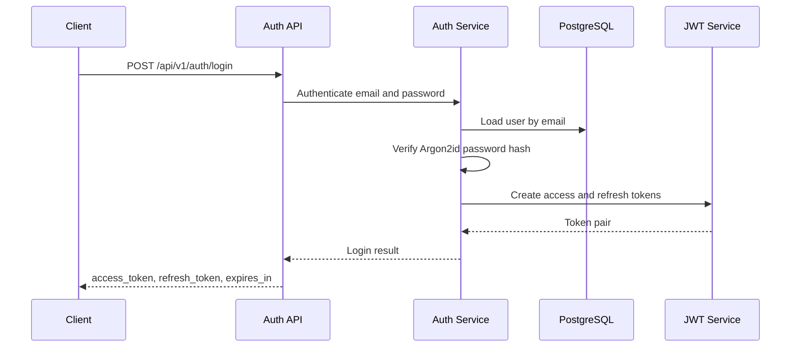
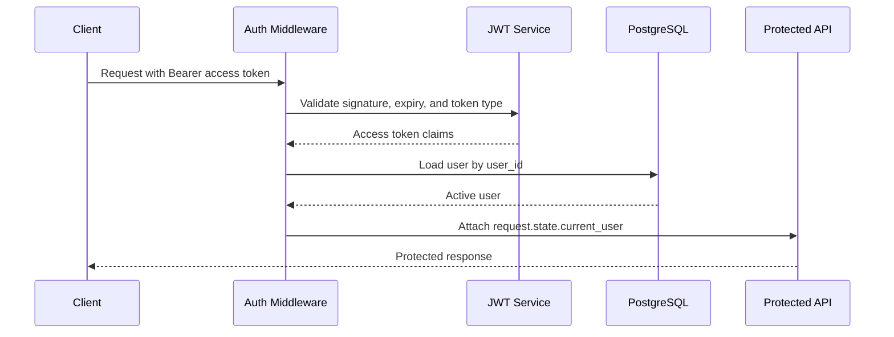
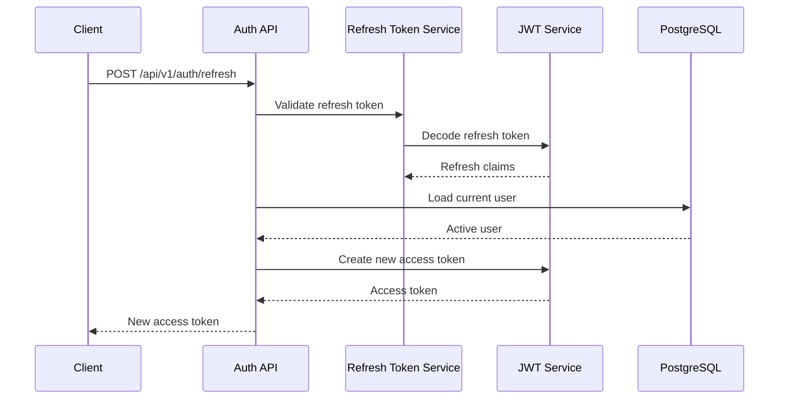

# Sprint 1 Authentication

## Purpose

This note documents the implemented Sprint 1 authentication foundation for the
backend application.

## Implemented Scope

- User registration with Argon2id password hashing.
- Login with email and password.
- JWT access and refresh token generation.
- Refresh-token exchange for a new access token.
- Current-user endpoint at `GET /api/v1/users/me`.
- Authentication middleware for protected `/api/v1` paths.
- Standard error envelopes for authentication failures.

## Public Paths

The following paths do not require an access token:

- `GET /health`
- `GET /api/v1/health`
- `POST /api/v1/auth/register`
- `POST /api/v1/auth/login`
- `POST /api/v1/auth/refresh`

All other `/api/v1` paths require:

```http
Authorization: Bearer <access_token>
```

## Token Behavior

- Access tokens use JWT token type `access`.
- Refresh tokens use JWT token type `refresh`.
- Access token lifetime follows ADR-009 and the current JWT service constant:
  15 minutes.
- Refresh token lifetime is 30 days.
- Refresh-token exchange validates the refresh token, loads the current user,
  rejects disabled or soft-deleted users, and issues the new access token from
  the current database user record.

## JWT Usage

Use access tokens for protected API calls:

```http
Authorization: Bearer <access_token>
```

Do not send refresh tokens in the `Authorization` header. Refresh tokens are
accepted only by:

```http
POST /api/v1/auth/refresh
Content-Type: application/json
```

```json
{
  "refresh_token": "<jwt-refresh-token>"
}
```

Clients should treat both token values as secrets and must not log them.

## Current User Context

Protected API requests are authenticated before route handling. The middleware:

- extracts the Bearer token,
- validates signature, expiration, and token type,
- loads the user,
- rejects missing, disabled, or soft-deleted users,
- attaches the user to `request.state.current_user`.

Route handlers should continue to use:

```python
Depends(get_current_user)
```

This keeps ownership validation explicit at the API/service boundary.

## Authentication Flow Diagrams

### Login



### Protected Request



### Refresh



## API Examples

### Register

```json
{
  "email": "murali@example.com",
  "password": "SecurePass1",
  "display_name": "Murali Yandra"
}
```

```json
{
  "success": true,
  "data": {
    "user_id": "550e8400-e29b-41d4-a716-446655440000"
  }
}
```

### Login

```json
{
  "email": "murali@example.com",
  "password": "SecurePass1"
}
```

```json
{
  "success": true,
  "data": {
    "access_token": "<jwt-access-token>",
    "refresh_token": "<jwt-refresh-token>",
    "expires_in": 900
  }
}
```

### Current User

```http
GET /api/v1/users/me
Authorization: Bearer <jwt-access-token>
```

```json
{
  "success": true,
  "data": {
    "id": "550e8400-e29b-41d4-a716-446655440000",
    "email": "murali@example.com",
    "display_name": "Murali Yandra",
    "timezone": "Asia/Kolkata",
    "default_currency": "INR"
  }
}
```

### Refresh

```json
{
  "refresh_token": "<jwt-refresh-token>"
}
```

```json
{
  "success": true,
  "data": {
    "access_token": "<new-jwt-access-token>"
  }
}
```

## Error Codes

Authentication failures return the standard error envelope with:

- `INVALID_TOKEN`
- `TOKEN_EXPIRED`
- `INVALID_CREDENTIALS`
- `ACCOUNT_DISABLED`

Token values, passwords, stack traces, and internal details are not returned to
API clients.

## Test Commands

Run the authentication-focused suite:

```powershell
uv run pytest tests\test_auth_middleware.py tests\test_auth_login_endpoint.py tests\test_auth_refresh_endpoint.py tests\test_current_user_endpoint.py tests\test_jwt.py tests\test_refresh_token.py tests\test_security.py
```

Run the full backend suite:

```powershell
uv run pytest
```

The API examples above are validated against the same response shapes covered by
the authentication endpoint and middleware tests.
